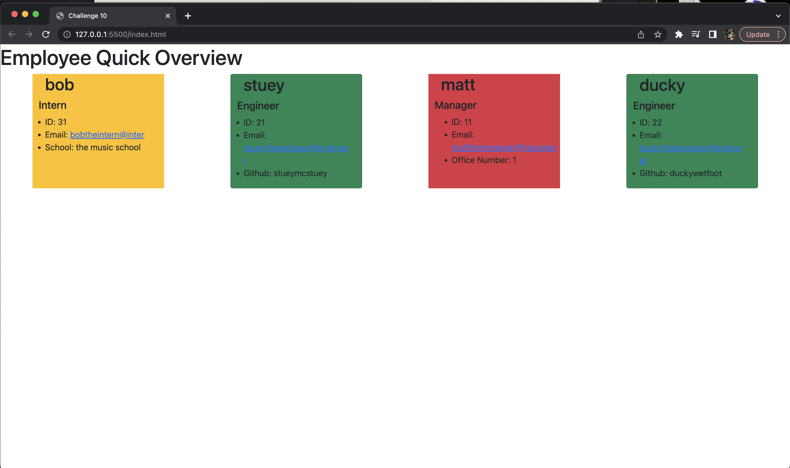

# Team Profile Generator

## Description

I was wanting to use the command-line application from the terminal to take in user input so that from the input an html file would be generated to display each employee with their name, ID, email, and information specific to the individuals.  One thing that I learned was how to use classes and then extend them with subclasses.

## Installation

In order to run this project you will need to run '< npm i>' in the command line to install the node modules.  After that you type in '< node index.js>' to run application.  Afterwords your document will be created.

## Usage 

The following is a link to a video demonstrating the application and its capabilities.

https://drive.google.com/file/d/1mve5beD7bzXrlTMXq5LlriUFw8kaJ_fV/view 

The following is a screenshot of the completed application being run through the node index.js and its appearance of the html file afterwards.

## Tests
You can run npm test in the command line and it will run through the test suites that are located in the test folders by using the jest application.